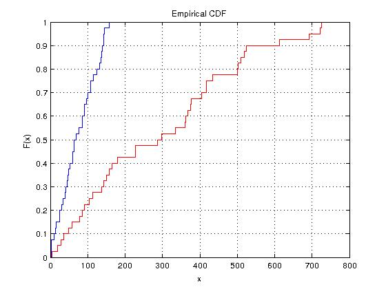

#Sample testing
Basic testing of encryption and non encryption methods on Elasticsearch.

1. [Generating data](#gd)
2. [Cleaning up the data](#cutd)
3. [Uploading data](#ud)
4. [Searching data](#sd)
5. [Analysis](#an)

<a name="gd">
###1. Generating data
</a>
106 text files from Project Gutenberg were used which totalled to a total of 58M of data. The 'cleaned' files are present in this directory in _data.zip_. I do not own this data and it is only used for testing.


<a name="cutd">
###2. Cleaning up the data
</a>

Cleaning the data of invalid characters shrunk the data to 54MB.


<a name="ud">
###3. Uploading data
</a>
**Non encryption:**
Prior to uploading to Elasticsearch, the Elasticsearch took up 31M. After uploading, the data inflated to 126M.

**Encryption:**
* Encrypting the data from (2) inflated the data to 312M.
* Prior to uploading to Elasticsearch, the Elasticsearch took up 32M. After uploading, the data inflated to 341M.
(data and later on search query terms were encrypted under key: mykey).

<a name="sd">
###4. Searching data
</a>
40 random words were selected to search on Elasticsearch.

**Non encryption:**
```
Search-Word          Total-time           Result-size     Search-Time(ms)
-------------------------------------------------------------------------
chilly               0m6.548s             6.7M            64             
tightfisted          0m0.317s             193             3              
opposite             0m38.284s            45M             100            
recess               0m19.770s            23M             64             
fit                  0m42.278s            50M             107            
unaccountable        0m12.423s            14M             52             
cross                0m40.864s            48M             116            
letter               0m46.033s            53M             135            
roll                 0m33.016s            39M             86             
efficient            0m11.290s            13M             35             
languid              0m17.217s            18M             46             
glib                 0m2.548s             2.6M            16             
victorious           0m27.607s            33M             97             
challenge            0m21.135s            25M             92             
juicy                0m2.243s             2.2M            14             
price                0m41.203s            47M             139            
cats                 0m16.411s            20M             59             
momentous            0m10.744s            12M             39             
hook                 0m19.253s            23M             91             
veil                 0m32.178s            38M             138            
friction             0m10.332s            12M             76             
offbeat              0m0.309s             193             3              
classy               0m0.244s             193             3              
war                  0m43.982s            51M             145            
part                 0m45.652s            53M             143            
unpack               0m0.958s             649K            11             
partner              0m26.207s            31M             124            
move                 0m43.058s            50M             143            
frightening          0m4.606s             4.9M            30             
invent               0m17.036s            21M             47             
spoon                0m12.735s            15M             107            
mundane              0m9.650s             11M             41             
clap                 0m16.955s            20M             86             
thirsty              0m25.133s            30M             60             
crate                0m3.463s             3.7M            25             
bright               0m40.051s            47M             132            
jog                  0m2.954s             3.0M            24             
mark                 0m43.384s            52M             157            
groan                0m23.798s            28M             69             
kettle               0m12.996s            15M             49 
```

**Encryption:**
The same words were used (matching order) for searching. In this case, they are just encrypted.
```
Search-Word                              Total-time           Result-size     Search-Time(ms)
---------------------------------------------------------------------------------------------
0x40738547bd798fcef19140319324fbe        0m33.568s            39M             228            
0xa1974ad6abe1448f2fbd85bfa3be514        0m0.344s             194             36             
0xafdceb4312fd616ffe7912d23bf4f44        3m23.410s            259M            524            
0x5132a97cdf62590e15a6a6b127d16b9        1m43.036s            134M            297            
0xb13b9dcc7469fc91419d9bddbe7733de       3m43.095s            289M            518            
0x918490fa289ddc1af0686c77c666b          1m1.711s             80M             367            
0x718cdbad7ae0f85426ce76b81554ecf        3m34.049s            271M            418            
0xe098f6fd92f289d8c79a55c7341ff8         3m35.397s            284M            693            
0x518fd0a05a2a9ca566c36c4f5d74ba8        2m50.736s            224M            501            
0xfa489b651c158fd1f154584ff9a887         0m58.586s            76M             114            
0xa4f85384d9d7b77569978a3e4edbdbc        1m18.601s            100M            165            
0xfc94b063244a78ee6beb6bffe6eddfad       0m12.045s            16M             58             
0xf9bad73b2c722652a8dd1a2b872b237        2m21.508s            185M            227            
0xa02de75a7abf17936b0da89fa16c723        1m46.602s            143M            375            
0x7fdda3fdb1dc94d6b9d48569869352a        0m10.377s            13M             48             
0x84e43940d437532c2c7c22265cbc89         3m27.303s            273M            361            
0xf046d641a99297475941d3f1227d18ee       1m27.455s            113M            363            
0xa74e897aa63b866aa141204fc945d4a        0m54.485s            71M             151            
0xbdfd8b6a64fe504cf52cb74ccdc423         1m38.899s            130M            179            
0xb0815cab19a72b0321726f67828dd76        2m49.665s            219M            335            
0x5f57ada55dab522f643437b8cf6a968a       0m53.206s            69M             158            
0xec1323365ec5e7836ca1d67997a837db       0m0.304s             193             4              
0xd25382bf62a27041c611306c6ef61f5        0m0.344s             194             19             
0xc5fa1ccb2e9a9463344091bc19af4e9d       3m48.767s            297M            612            
0xe9cccadbbf29bbfb5cd1f27586de1ff        3m54.946s            311M            502            
0x5296a8db59057a3dfbd691d627c1bd0        0m3.295s             3.7M            29             
0x57892d6abbe26d8375cf036f010eaf7        2m21.909s            183M            434            
0x3fa46df96e839fb61c92f0f4eaa9           3m44.785s            291M            726            
0x83aaff913bdd8384f922af9a8d71068        0m23.418s            29M             85             
0x8344b16eef6c15c2f5d6d585f625b8bf       1m29.151s            117M            418            
0x18feb1eeba6ba8554b62f3720b0507c        1m7.500s             86M             143            
0x87190dc9d820b5aee3ad1c40c18211         0m50.699s            65M             105            
0xee915dd9b4a5213f9a94e22ecf27baa0       1m21.782s            106M            377            
0xb7e0f99d153e47329dc3c1ba48a92eb        2m7.825s             167M            286            
0x8547a71477c3c5a1f3762dea498a53a        0m17.565s            23M             79             
0x4732ed6db5fc22caad8ceae8215985e6       0m5.337s             277M            404            
0xe463a4978cd2f369ef8a513b3012931a       0m14.854s            18M             91             
0xa4556df422fc276bdeea3a2145451c60       3m47.833s            301M            722            
0xa5d2d5ccebc78f2d2131f852f0915dc2       2m3.418s             165M            510            
0x3b5c8a49606ba8ddf099d183c27b3d12       0m48.317s            63M             137 
```
Note: This does table does not include the additional overhead of decryption at client end.

**Both:**
Here is another table, with the data between non encrypted and encrypted side by side for comparison.
```
Search-Word     Total-time              Result-size   Search-Time(ms)
-------------------------------------------------------------------------
chilly         | 0m6.548s  - 0m33.568s | 6.7M - 39M  | 64  - 228 
tightfisted    | 0m0.317s  - 0m0.344s  | 193  - 194  | 3   - 36  
opposite       | 0m38.284s - 3m23.410s | 45M  - 259M | 100 - 524 
recess         | 0m19.770s - 1m43.036s | 23M  - 134M | 64  - 297 
fit            | 0m42.278s - 3m43.095s | 50M  - 289M | 107 - 518 
unaccountable  | 0m12.423s - 1m1.711s  | 14M  - 80M  | 52  - 367 
cross          | 0m40.864s - 3m34.049s | 48M  - 271M | 116 - 418 
letter         | 0m46.033s - 3m35.397s | 53M  - 284M | 135 - 693 
roll           | 0m33.016s - 2m50.736s | 39M  - 224M | 86  - 501 
efficient      | 0m11.290s - 0m58.586s | 13M  - 76M  | 35  - 114 
languid        | 0m17.217s - 1m18.601s | 18M  - 100M | 46  - 165 
glib           | 0m2.548s  - 0m12.045s | 2.6M - 16M  | 16  - 58  
victorious     | 0m27.607s - 2m21.508s | 33M  - 185M | 97  - 227 
challenge      | 0m21.135s - 1m46.602s | 25M  - 143M | 92  - 375 
juicy          | 0m2.243s  - 0m10.377s | 2.2M - 13M  | 14  - 48  
price          | 0m41.203s - 3m27.303s | 47M  - 273M | 139 - 361 
cats           | 0m16.411s - 1m27.455s | 20M  - 113M | 59  - 363 
momentous      | 0m10.744s - 0m54.485s | 12M  - 71M  | 39  - 151 
hook           | 0m19.253s - 1m38.899s | 23M  - 130M | 91  - 179 
veil           | 0m32.178s - 2m49.665s | 38M  - 219M | 138 - 335 
friction       | 0m10.332s - 0m53.206s | 12M  - 69M  | 76  - 158 
offbeat        | 0m0.309s  - 0m0.304s  | 193  - 193  | 3   - 4   
classy         | 0m0.244s  - 0m0.344s  | 193  - 194  | 3   - 19  
war            | 0m43.982s - 3m48.767s | 51M  - 297M | 145 - 612 
part           | 0m45.652s - 3m54.946s | 53M  - 311M | 143 - 502 
unpack         | 0m0.958s  - 0m3.295s  | 649K - 3.7M | 11  - 29  
partner        | 0m26.207s - 2m21.909s | 31M  - 183M | 124 - 434 
move           | 0m43.058s - 3m44.785s | 50M  - 291M | 143 - 726 
frightening    | 0m4.606s  - 0m23.418s | 4.9M - 29M  | 30  - 85  
invent         | 0m17.036s - 1m29.151s | 21M  - 117M | 47  - 418 
spoon          | 0m12.735s - 1m7.500s  | 15M  - 86M  | 107 - 143 
mundane        | 0m9.650s  - 0m50.699s | 11M  - 65M  | 41  - 105 
clap           | 0m16.955s - 1m21.782s | 20M  - 106M | 86  - 377 
thirsty        | 0m25.133s - 2m7.825s  | 30M  - 167M | 60  - 286 
crate          | 0m3.463s  - 0m17.565s | 3.7M - 23M  | 25  - 79  
bright         | 0m40.051s - 0m5.337s  | 47M  - 277M | 132 - 404 
jog            | 0m2.954s  - 0m14.854s | 3.0M - 18M  | 24  - 91  
mark           | 0m43.384s - 3m47.833s | 52M  - 301M | 157 - 722 
groan          | 0m23.798s - 2m3.418s  | 28M  - 165M | 69  - 510 
kettle         | 0m12.996s - 0m48.317s | 15M  - 63M  | 49  - 137 
```

<a name="an">
###5. Analysis
</a>

CDF for search-time's for non encryption vs encryption:



CDF for total-time's for non encryption vs encryption:

![alt text][cdf2]


[cdf1]: https://github.com/mannyray/es_basic_encryption/tree/master/sample_test/cdf1.jpg "CDF for search times of no encryption."
[cdf2]: https://github.com/mannyray/es_basic_encryption/tree/master/sample_test/ne_es_total.jpg "CDF for search times of no encryption."
